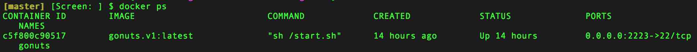

# VIM+GO Dev Env
## For people who want *GOnuts*.

Sets you up with a GO development env with some useful VIM GO plugins inside of a docker container. This makes sure you have your favorite development env always with you even if you are using your spouse's laptop. ;)

####Mac users:
* Install [boot2Docker](https://github.com/boot2docker/osx-installer/releases)
* Once installed, launch boot2Docker.
  
* git clone https://github.com/shriramsharma/shriramsharma-gonuts.git
* Build docker image
  ``` docker build -t gonuts/gonuts . ```
* Run docker container. I am forwarding host port 2222 to container's default ssh port. You may specify any port you want.
  ``` docker run -d -p 2222:22 --name gonuts gonuts/gonuts ```
* Do ``` docker ps ``` to verify if the container is running.
  
* Get the ip by running ```boot2Docker ip```.
* ``` ssh root@<boot2Docker_IP_FROM_ABOVE> -p 2223 ```
* After logging in run the below command to install all the vim plugins.
  ``` vim +PluginInstall +GoInstallBinaries +qall ```
* It might complain about YouCompleteMe plugin. To fix it, run the below command.
  ``` sh ~/.vim/bundle/YouCompleteMe/install.sh ```

That should be it.

Feel free to fork and replace my dotfiles with yours. I know people have there own favorite plugins. These are the ones that I use.
