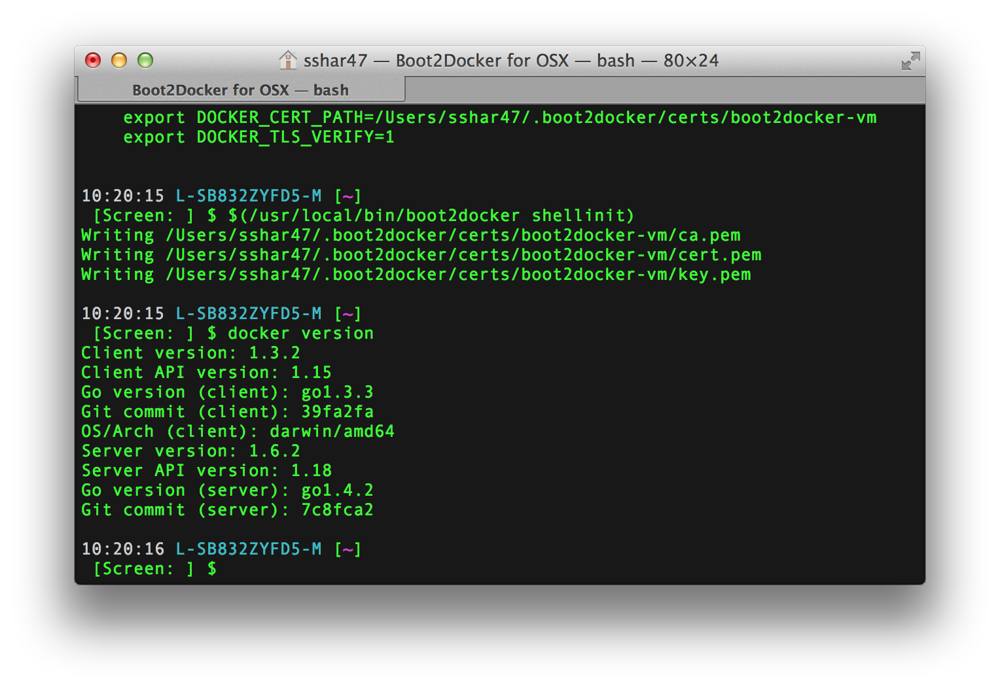

# VIM+GO Dev Env
## For people who want *GOnuts*.

Sets you up with a GO development env with some useful VIM GO plugins inside of a docker container. This makes sure you have your favorite development env always with you even if you are using your spouse's laptop. ;)

####Mac users:
* Install [boot2Docker](https://github.com/boot2docker/osx-installer/releases)
* Once installed, launch boot2Docker.
  
* git clone https://github.com/shriramsharma/shriramsharma-gonuts.git
